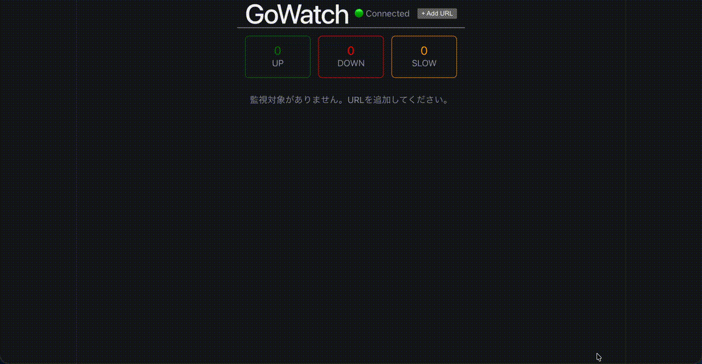

# GoWatch

Go + React で構築した URL 死活監視ダッシュボード。
登録した URL を goroutine で定期的に並行ヘルスチェックし、ステータスとレスポンスタイムを WebSocket でリアルタイムに表示する。



---

## 動機

### なぜこれを作ったのか

自作の資産管理アプリを本番運用しており、その死活監視を自分で行いたかった。
代表的な監視ツールは存在するが、自作することで Go の並行処理を実践的に学ぶことに意義があると考えた。

### なぜ Go なのか

監視ツールは起動から停止まで goroutine が常に動き続ける設計になる。
goroutine の「起動・管理・停止」を全工程で学べる題材として Go を選んだ。

---

## アーキテクチャ

```text
[Ticker: 30秒ごと]
      ↓
[サイクル重複チェック] ← sync.Mutex
      ↓
[URLリスト取得]
      ↓
[job channel に投入]
      ↓
[Worker Pool (5 goroutine)]
  各 worker が HTTP GET
      ↓
[result channel]
      ↓
[結果受信 goroutine]
  ├→ SQLite に保存
  ├→ WebSocket で push
  └→ DOWN 検知時に Slack 通知
```

---

## 技術的ハイライト

| 要素               | 詳細                                                     |
| ------------------ | -------------------------------------------------------- |
| Worker Pool        | 同時実行数制御、監視対象増加へのスケーラビリティ         |
| time.Ticker        | 30秒ごとの定期実行ループ                                 |
| context 階層       | アプリ > サイクル(25秒) > 個別URL(5秒) の3層タイムアウト |
| graceful shutdown  | SIGTERM で全 goroutine を安全停止                        |
| sync.Mutex         | サイクル重複実行防止                                     |
| WebSocket          | チェック結果を1件ずつリアルタイムpush                    |
| Notifier interface | 消費側(checker)がinterfaceを定義、通知先を差し替え可能   |

---

## セットアップ

### 必要環境

- Docker
- Docker Compose

### 起動手順

```bash
git clone https://github.com/north238/go-watch.git
cd go-watch
docker compose up
```

ブラウザで <http://localhost:5173> を開く。

### Slack通知の設定（任意）

Slack の Incoming Webhook URL を設定すると、DOWN 検知時に Slack へ通知が届く。
未設定の場合は通知なしで起動する。

プロジェクトルートに `.env` ファイルを作成して設定する。

```bash
# .env
SLACK_WEBHOOK_URL=https://hooks.slack.com/services/xxx
```

---

## 使い方

1. `+ Add URL` ボタンをクリック
2. 監視したい URL と表示名を入力して追加
3. 30秒ごとにヘルスチェックが実行される
4. ステータスが DOWN になるとトースト通知が表示される
5. Slack 通知が設定されている場合は Slack にも通知が届く
6. テーブルの行をクリックするとレスポンスタイム推移グラフが表示される

---

## 今後の拡張予定

- Discord など他サービスへの通知追加（Notifier interface の実装を追加するだけで対応可能）
- メール通知
- ユーザー認証
- SSL 証明書チェック
- 本番デプロイ
- per-URL チェック間隔設定

---

## 設計の限界

- GoWatch 自体が落ちた場合は検知できない（監視する側と監視される側が同一プロセス）
- SQLite のためスケールアウトができない

---

## Tech Stack

| Layer     | Technology                |
| --------- | ------------------------- |
| Backend   | Go (net/http)             |
| WebSocket | gorilla/websocket         |
| Frontend  | React + TypeScript (Vite) |
| DB        | SQLite                    |
| Infra     | Docker Compose            |
